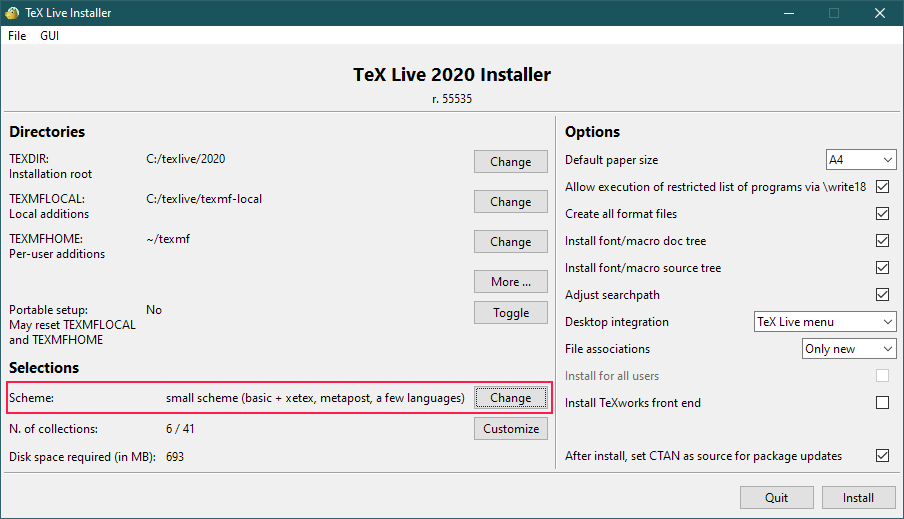

# Markdown Publishing Workflow

This publishing workflow relies on [Pandoc](https://pandoc.org/) to convert
[Markdown](https://pandoc.org/MANUAL.html#pandocs-markdown) files to HTML and TeX output files,
using LaTeX to produce PDF files from Pandoc's TeX output. By default, the HTML documents produced
are 'self-contained', with external resources (such as images or CSS stylesheets) embedded in the
HTML file. This strategy is used to reduce the chance of network filters or firewalls causing the
HTML to be displayed incorrectly. 

The publishing process recognises a number of items of document metadata, which will be inserted
into the output file. The publishing script automatically retrieves the ID and date of any latest
Git commit to insert into the document. The Markdown file can contain a YAML metadata block, which
can hold a number of items that will be used, for example:

```yaml
---
title: "My Markdown document"
author: "My Name"
issue: "1"
pubdate: "2020-03-03"
---
```

The `pubdate` item will override any Git commit date retrieved by the publishing script.

The Markdown document can also contain diagrams, as recognised by the Pandoc ['diagram-generator'
filter](https://github.com/pandoc/lua-filters/tree/master/diagram-generator).

## Installation

Clone this repository to a directory on your machine & include the root on your `PATH`. Use the
relevant script (`publish.sh` for bash, `publish.cmd`) to publish HTML & PDF variants of your
Markdown document.

### Pre-requisites

The following software is required by this workflow:

#### Pandoc
This workflow has been tested with Pandoc version 2.0.1. Pandoc performs conversion of Markdown to
HTML and TeX formats, and orchestrates conversion of TeX to PDF.

#### LaTeX
Used by Pandoc to produce PDFs from TeX files. The conversion process requires the XeLaTeX program
to be installed, as this enables use of Unicode in your Markdown document and allows use of
operating system fonts rather than just those supplied with LaTeX.

The combination of Pandoc, XeLaTeX and the template used by this workflow(a slightly modified
version of [eisvogel.tex](https://github.com/Wandmalfarbe/pandoc-latex-template)) requires a number
of LaTeX packages to be installed. The easiest way to achieve this is to use
[TeX Live](http://www.tug.org/texlive/) to install LaTeX, using the 'small' installation scheme, as
shown here:



Once this is done, the TeX Live Manager (`tlmgr`) can be used to ensure the following are all installed

> amsfonts, amsmath, babel, biber, biblatex, bibtex, bidi, booktabs, csquotes, epstopdf, fancyvrb,
> fontspec, footnotebackref, footnotehyper, geometry, graphics, hyperref, iftex, letltxmacro,
> listings, lm, lm-math, logreq, lualatex-math, luatex, ly1, mathspec, mdframed, microtype,
> mweights, natbib, needspace, oberdiek, pagecolor, pdftexcmds, polyglossia, setspace,
> sourcecodepro, sourcesanspro, titling, tools, ulem, unicode-math, upquote, xcolor, xecjk, xetex,
> xurl, zref

Note: this is a best approximation of the required packages, taken from the Dockerfiles for an
[eisvogel specific container](https://github.com/tewarid/docker-pandoc) and the [Pandoc/LaTeX
container](https://github.com/pandoc/dockerfiles#alpine-linux) it's based on.

#### Java
Java is required to use [PlantUML](https://plantuml.com/) via the [Pandoc diagram-generator Lua
filter](https://github.com/pandoc/lua-filters/tree/master/diagram-generator). The PlantUML binary (a
JAR file) is bundled with the workflow.

#### Librsvg
This [software](https://en.wikipedia.org/wiki/Librsvg) is use to convert SVG files (as produced by
PlantUML) to PDF for embedding as a scalable vector image in output PDF documents. The required
component is rsvg-convert.

## Usage

### Windows

The `publish.cmd` script should be invoked, with paths to the Markdown document(s) to be converted
supplied as command-line arguments.

### Linux

The `publish.sh` script should be invoked, with paths to the Markdown document(s) to be converted
supplied as command-line arguments.

This script also recognises a number of command-line options that can be used to affect the publishing workflow:

| Option               | Description                                                                                                 |
|----------------------|-------------------------------------------------------------------------------------------------------------|
| `-h`, `--html`       | Output HTML document.                                                                                       |
| `-p`, `--pdf`        | Output PDF document.                                                                                        |
| `-t`, `--tex`        | Output TeX source code.                                                                                     |
| `-q`, `--quick-html` | Keep external links in output HTML. By default, these are resolved to resources contained in the HTML file. |
| `-o`, `--output`     | Specify output file's basename - the appropriate extension will be added.                                   |
| --help               | Display usage message.                                                                                      |

By default, HTML and PDF output is produced. Selecting any of the output
options (`--html`, `--pdf` or `--tex`) disables this default.
